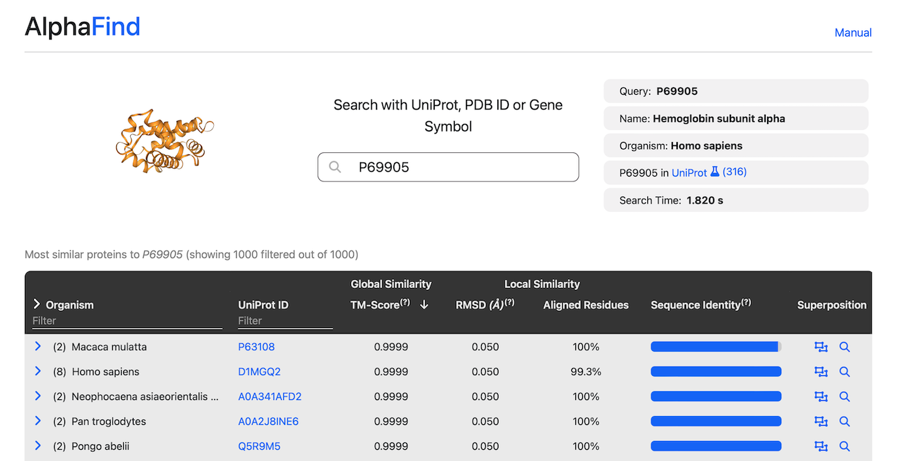

# AlphaFind Web Application
AlphaFind ([https://alphafind.fi.muni.cz/](https://alphafind.fi.muni.cz/)) is a web-based search engine that allows for fast structure-based search of the entire set of AlphaFold DB protein structures.

This repository contains the source code of the AlphaFind's front-end.

{width=40%}

## Running locally

```shell
# Build the docker image
docker build -t alphafind:ui -f ./Dockerfile .

# Run the AlphaFind UI
docker run -p 8081:8081 alphafind:ui
```

The app will be available at [http://localhost:8081](http://localhost:8081).

## Development
### Prerequisites
- Node.js >= v20.9.0
    - [https://nodejs.org/en/download](https://nodejs.org/en/download)

```
npm install
npm run dev
```
for tests:
```
npm run test
```
Note that tests require a running instance of the AlphaFind API.

## Contact
- Author: Jakub Čillík
- Email: 524749@mail.muni.cz
